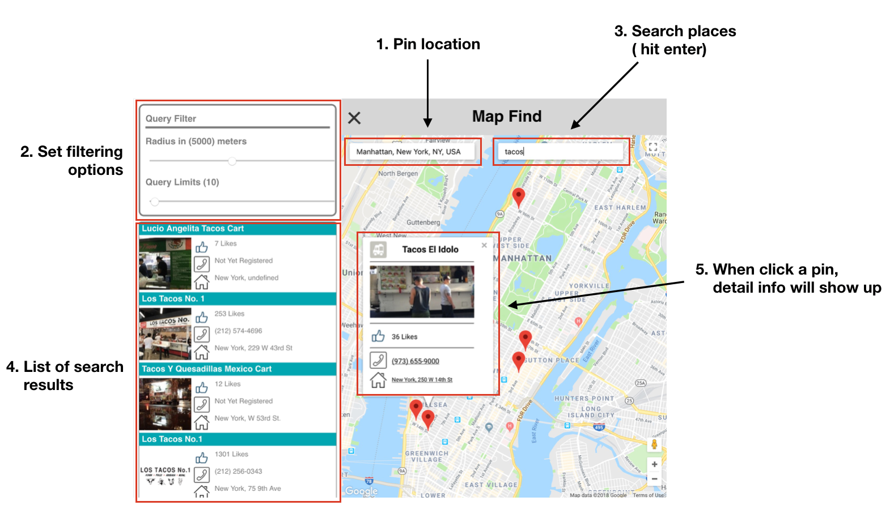

# Map Search in React

## Introduction
This project demonstrates how to build google map application with third party APIs (Foursquare API here) in React. This app is created from scratch using 'create-react-app' for the boiler-plate codebase.

## Main features

* Pinning a location of your interest
* Searching any places of your interest based on the pinned location
* Setting filtering options (radius, limits)
* Select a place for further information

## Dependencies
* [google-maps-react](https://github.com/google-map-react/google-map-react)
* [react-timer-mixin](https://www.npmjs.com/package/react-timer-mixin)
* [react-dom](https://www.npmjs.com/package/react-dom)

## How to run the app?
1. cd ./app
2. npm install
3. yarn start

## Resources
```
.
├── API
│   └── FSAPIs.js
├── Map
│   ├── GoogleMapsContainer.js
│   ├── Map.css
│   ├── MapStyleOptions.json
│   ├── SearchBox.css
│   ├── SearchBox.js
│   └── VenueSearchBox.js
├── Side
│   ├── SideMenu.css
│   └── SideMenu.js
├── Top
│   ├── NavButton.css
│   ├── NavButton.js
│   ├── Top.css
│   └── Top.js
├── images
│   ├── address.png
│   ├── like.png
│   └── phone.png
├── App.css
├── App.js
├── index.css
├── index.js
└── registerServiceWorker.js
```
